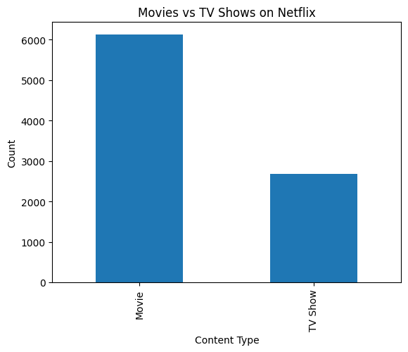
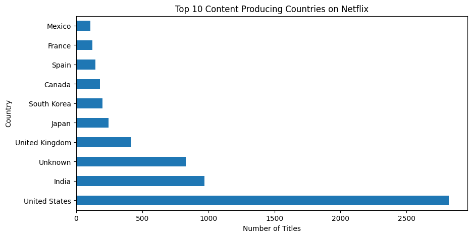
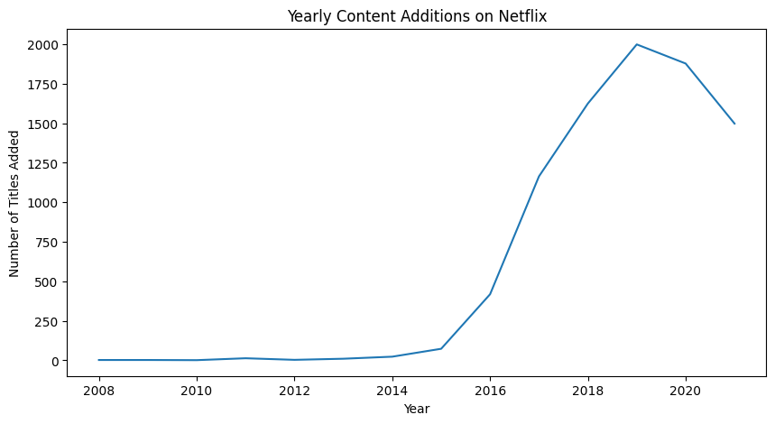
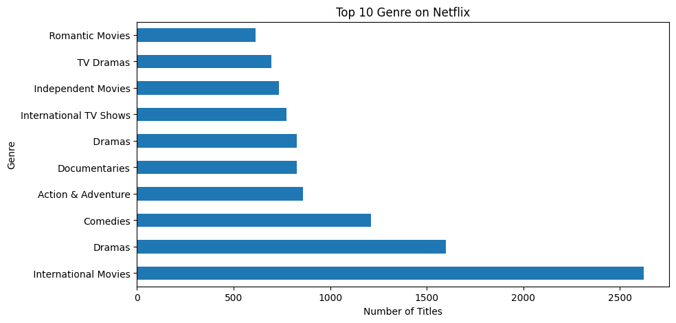

# Netflix Content Analysis

## Project Overview

This project performs Exploratory Data Analysis (EDA) on the Netflix Movies and TV Shows dataset using Python, Pandas, and Matplotlib.

The goal of this analysis is to understand Netflix’s content strategy by examining:

* Content type distribution (Movies vs TV Shows)
* Country-wise content production
* Yearly content growth
* Popular genres on the platform

## Dataset

The dataset contains information about Netflix titles such as:

* Type (Movie or TV Show)
* Country
* Release year
* Date added to Netflix
* Genre (listed_in)
* Cast and Director details

Each row represents one title available on Netflix.

## Key Insights

1. Movies dominate Netflix compared to TV Shows.
2. The United States produces the highest number of titles.
3. Netflix significantly increased content addition after 2016.
4. TV Shows are increasing because they improve user engagement.
5. International Movies are among the most common genres, showing Netflix’s global expansion strategy.

## Visualizations

### Movies vs TV Shows

### Top Producing Countries

### Yearly Content Growth

### Top Genres

## Tools & Technologies

* Python
* Pandas
* Matplotlib

## Conclusion

The analysis suggests that Netflix relies heavily on U.S. content but is rapidly expanding globally through international titles. The platform is also focusing on recent content and long-form TV shows to retain viewers and stay competitive in the streaming market.

## Business Recommendations

Based on the analysis:

* Netflix should continue investing in international content to grow its global subscriber base.
* Increasing production of TV shows can improve user retention due to longer engagement time.
* The platform should focus on recent releases, as users prefer newly added content.
* Expanding content production beyond the United States can reduce regional dependency and increase market reach.

